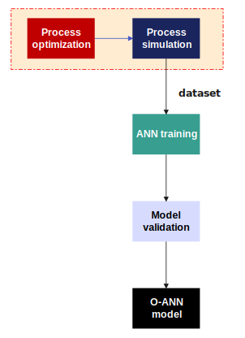

# Model-Optimization-guided Neural Networks

In this repository, we provide the algorithms developed in the strategy "Model Optimization-guided Neural Networks" [MOGNN]. The strategy is based on two steps: [i] optimization of a physical model, using the algorithm Particle Swarm Optimization [PSO] and [ii] neural network training with optimized data.
In this work, the goal is to apply approximate models for the optimization of chemical processes. In the proposed strategy, steady-state optimization is performed in a pre-training step, as shown in figure below. The steps can be divided into [1] data collection: process simulation-optimization, [2] ANN training, [3] model validation and [4] application of the ANN model.

  

The codes, developed in python language, are divided into two parts: [a] optimize.py and [b] ann_training.py. The optimize.py file optimizes a given physical model for different scenarios (input variables). This routine generates, thus, an optimal data set, with independent variables (input variables) and optimized decision variables (output variables). The ann_training.py file imports the data from the routine [a] and feeds into a neural network training algorithm. Therefore, the optimal decision variables are the targets for neural network training.
